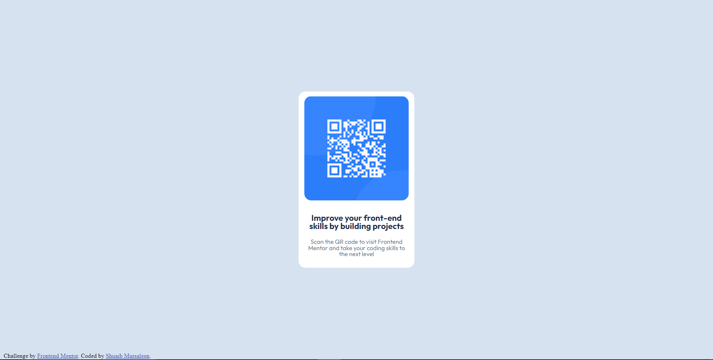

# Frontend Mentor - QR code component solution

This is a solution to the [QR code component challenge on Frontend Mentor](https://www.frontendmentor.io/challenges/qr-code-component-iux_sIO_H). Frontend Mentor challenges help you improve your coding skills by building realistic projects. 

## Table of contents

- [Overview](#overview)
  - [Screenshot](#screenshot)
  - [Links](#links)
- [My process](#my-process)
  - [Built with](#built-with)
  - [What I learned](#what-i-learned)

## Overview

### Screenshot

### Links
- Live Site URL: [QR Code](https://saul077.github.io/QR_code/)

## My process

### Built with

- Semantic HTML5 markup
- CSS custom properties
### What I learned

This project helped me grasp the basics of web development in depth, as I found myself searching up and learning about different ways to center objects and learning several css values to tweak with along the way. I'm excited to see my progress in a few months, to see how far I've come from this project, which I mark my first successfully launched web project!
